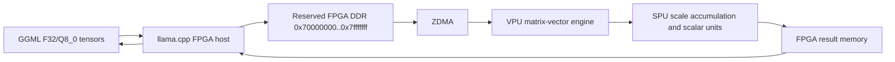

# Session Handoff: v88 FPGA Optimization and RTL Timing Continuation

## 1. Handoff Metadata

- Created: `2026-08-10T18:16:14+07:00`. `[VERIFIED: handoff collector timestamp]`
- Project root: `D:\DOAN`. `[VERIFIED: collector output]`
- Handoff mode: `CREATE`; the stale V79/P3 handoff was replaced because the owner rolled the project back to v88.
- Parent branch: `main`. `[VERIFIED: collector output]`
- Parent HEAD: `59c5626b31e2c40ec25c62706aaf93878e6da4ed`, subject `Roll back to stable version, the optimization will start from here`. `[VERIFIED: local Git and collector]`
- Parent upstream state: ahead 1, behind 4 relative to `origin/main`. `[VERIFIED: collector output; no network refresh was performed by the collector]`
- `llama.cpp` branch and HEAD: `main`, `8c24927d0c50b921d19b4e03699a9fbdb773e595`. `[VERIFIED: local Git; GitHub connector confirmed the commit]`
- `DATN_RTL` branch and HEAD: `spu`, `8fc83108df3d4aa23bcc1a31125ee764047fa821`. `[VERIFIED: local Git; GitHub connector confirmed the commit]`
- Previous handoff archive: not created because the owner requested recreation, not preservation of the obsolete V79 continuation plan.
- Repository collection: `COMPLETE` for the parent repository. Child repository state was collected separately with local Git.
- Validation: `PASS WITH WARNINGS` on 2026-08-10. Command: `validate_handoff.py D:\DOAN\handoff.md --repo-root D:\DOAN`. Warnings are reviewed below: most are false-positive path parsing of Git refs, Linux board paths, signal names, units, and repository-relative child paths; substantive warnings are addressed with explicit anchors and evidence labels.

## 2. Why This Work Exists

[USER-REPORTED: The project deploys Gemma 3 1B Q8_0 inference on a ZCU104. The performance goal is 2.5 tokens/s.]

[VERIFIED: `llama.cpp` implements the host runtime and FPGA driver. `DATN_RTL/RTL` implements the VPU, SPU, AXI mapping, and local memories. The host transfers activation, weight, scale, and result data through reserved FPGA DDR and ZDMA.]

The current engineering objective is to improve end-to-end inference without weakening numerical correctness, ownership checks, DDR bounds, DMA sequencing, or FPGA error handling. A local optimization is accepted only after its exact source is built, its applicable simulation passes, and owner-returned ZCU104 evidence shows no functional regression. Performance claims require comparable board runs.

## 3. Current Objective

The active baseline is v88, not v89-v93. `[VERIFIED: parent rollback commit and current `llama.cpp` HEAD]`

The immediate RTL objective is to reduce routed net delay while preserving current function. The latest routed design achieved WNS `+0.323 ns` and WHS `+0.010 ns` at a `5.333 ns` clock period. The current worst setup path is inside `SPU_Q8_Scale_Accum`: scale-product DSP output through overflow/clamp logic to the next multiplier DSP input. The canonical RTL now preserves `product_scale_q32_r` as a fabric register, but this change has not been synthesized or implemented. `[VERIFIED: routed timing report and current RTL diff]`

The host optimization plan is evidence-first. Do not restore the rolled-back static-weight catalog, CRC, or residency implementations without a new explicit task and a current A/B gate.

## 4. Current State Summary

- Complete:
  - v88 host baseline is checked out at `8c24927d...`. `[VERIFIED: local Git and GitHub]`
  - Canonical `RTL/` at task start matched reference commit `dae3a07bfa62fe14c0decac5d9ad44b0ff3546f9`. `[VERIFIED: prior full `git diff dae3a07 -- RTL` returned empty before current RTL edits]`
  - The AXI MMIO read address was registered in canonical and packaged `AXI4_Mapping.v`; XSim passed; synthesis and implementation produced WNS `+0.323 ns`. `[VERIFIED: current diff, XSim log, Vivado reports]`
  - Obsolete P4 simulation references were removed from active source lists. Canonical RTL and the active SPU testbench contain no P4 logic. `[VERIFIED: repository search]`
  - Standard SPU XSim passes after P4 cleanup: `pass_count=94`, zero failure marker. `[VERIFIED: `manual_sim/xsim.log`]`
- Partially complete:
  - `product_scale_q32_r` has `(* dont_touch = "yes" *)` in canonical RTL. XSim passes. Synthesis timing is not available. `[VERIFIED: source and simulation]`
  - `AXI4_Mapping.v` exists in both canonical and packaged project source because Vivado compiles the packaged custom-IP mirror. The current project directory is now read-only; future Codex sessions must not synchronize it. `[VERIFIED: prior source-binding investigation and owner correction]`
- Not started:
  - A fresh owner-run synthesis and implementation for the `product_scale_q32_r` preservation change.
  - A comparable end-to-end v88 three-run performance baseline using the locked benchmark procedure in `optimization_plan_vi.md`.
- Blocked:
  - Codex cannot prove timing improvement for the latest SPU change because the owner will run synthesis and implementation.
  - Canonical RTL changes are not automatically consumed by the current packaged custom IP unless the owner updates the Vivado source package. Codex cannot edit `project_1`.
- Currently investigated:
  - Whether preserving the intended SPU pipeline boundary lowers the `3.220 ns` routing component of the current worst path.

## 5. Repository and Environment Anchor

- Parent repository: `D:\DOAN`, remote `CuongNgyn2005/codex-gpt-shared-communication`.
- Parent branch and HEAD anchor: `main` at `59c5626b31e2c40ec25c62706aaf93878e6da4ed`.
- Branch: `main`.
- HEAD commit: `59c5626b31e2c40ec25c62706aaf93878e6da4ed`.
- Host child: `D:\DOAN\llama.cpp`, remote `CuongNgyn2005/Infrastructure_GEMMA3`, branch `main`, HEAD `8c24927d...`, clean at the last child status inspection.
- RTL child: `D:\DOAN\DATN_RTL`, remote `CuongNgyn2005/LLM_GEMMA3-1B-INT8`, branch `spu`, HEAD `8fc83108...`, dirty.
- Parent HEAD: `59c5626b...`; parent is dirty.
- Parent modified entries: submodule `DATN_RTL` and `optimization_plan_vi.md`.
- Parent untracked task/report/context files include `TASK-007.md`, `TASK-008.md`, `RESULT-007.md`, `RESULT-008.md`, and `OPTIMIZATION_PLAN_V88_AUDIT.md`.
- Parent has untracked XSim artifacts under `rtl_xsim_runs/20260810_162452/`; do not stage or delete them without explicit permission.
- `DATN_RTL` owner-preexisting modified files include `project_1.xpr`, `result_prompt.txt`, and project metadata files. Preserve them.
- Current intentional RTL modifications include `RTL/AXI4_Mapping.v` and `RTL/SPU_Q8_Scale_Accum.v`.
- Current simulation configuration changes are under `DATN_RTL/DATN_VIVADO/manual_sim/`, which is locally untracked as a directory in the child repository.
- Staged files: none. `[VERIFIED: collector and child status]`
- Parent unstaged statistics before this handoff: 2 files, 471 insertions, 365 deletions. This excludes child-internal diff details.
- Host build directory required by the owner: `llama.cpp/build_mem`.
- Owner-approved host build commands:

  ```bash
  cmake -S . -B build_mem \
    -DUSE_FPGA=ON \
    -DCMAKE_BUILD_TYPE=Release \
    -DLLAMA_CURL=OFF

  cmake --build build_mem --target llama-cli -j2
  ```

- Vivado executable: `D:\Xlinx\Vivado\2022.2\bin\vivado.bat`. `[VERIFIED: successful local synthesis/implementation session]`
- Board: ZCU104 is not connected to this workspace. The owner operates it separately through UltraViewer.
- Model path used by owner commands: `./models/gemma-3-1b-it-Q8_0.gguf`. `[USER-REPORTED: board path]`
- Collection limitation: the parent `git submodule status` wrapper failed because Git shell utilities were unavailable. Child HEADs were collected directly.

## 6. Architecture and Data Flow



- `llama.cpp/ggml/src/ggml-cpu/fpga_host.cpp` owns host admission, UIO mapping, DDR staging, ZDMA submission, descriptor and bank ownership, MMIO polling, result collection, and fail-closed behavior.
- `DATN_RTL/RTL/MY_IP.v` owns the AXI interface and request serialization.
- `DATN_RTL/RTL/AXI4_Mapping.v` decodes MMIO and connects VPU/SPU registers and memories.
- `DATN_RTL/RTL/Matrix_Vector_Multiplication.v` and `PMAU_Full.v` implement the VPU GEMV datapath.
- `DATN_RTL/RTL/SPU_Top.v`, `SPU_Controller.v`, `SPU_Local_Memory.v`, and `SPU_Q8_Scale_Accum.v` implement SPU control, memory, and scale-aware accumulation.
- The active P2 weight layout is pair-interleaved and zero-pads the missing companion row for odd row counts. Do not change the layout without a new ABI.
- The safe physical DDR range is exactly `[0x70000000,0x80000000)`. The first address is valid. The end address is exclusive. Every access must prove `start >= 0x70000000` and `start + bytes <= 0x80000000` without overflow.
- Known board UIO mapping from owner evidence: ZDMA `/dev/uio4` at `0xfd500000`, MY_IP `/dev/uio14` at `0xa0000000`, and low FPGA DDR `/dev/uio15` at `0x70000000`.
- `project_1/component.xml` packages source files from `DATN_VIVADO/project_1/src/`. Prior clean synthesis proved that editing only canonical `RTL/AXI4_Mapping.v` did not alter the netlist until the packaged IP output products were regenerated. Future sessions must report this source-binding fact but must not edit `project_1`.

## 7. Decisions and Rationale

### Stable baseline

- Decision: optimize from v88 host commit `8c24927d...`.
- Reason: the owner observed repeated performance regressions in later v89-v93 work and explicitly rolled back.
- Evidence: parent rollback commit and current host HEAD.
- Rejected alternative: continue incrementing version numbers from v93.
- Consequence: later benchmark and optimization commits are historical evidence, not current implementation.
- Status: final until the owner changes the baseline.

### Vivado project ownership

- Decision: `DATN_RTL/DATN_VIVADO/project_1/` is read-only.
- Reason: owner instruction and root repository rules.
- Evidence: current conversation and `rules.txt`.
- Consequence: inspect reports and generated source binding only. Do not edit XPR, packaged source, generated output, checkpoints, or reports.
- Status: final.

### RTL timing method

- Decision: pipeline the exact reported startpoint-to-endpoint path; do not add unrelated registers.
- Reason: the previous MMIO path was 95.9% routing delay, and a registered request boundary removed it from the worst-path list.
- Evidence: routed timing reports before and after the AXI change.
- Alternative: placement directives or arbitrary delay registers. Rejected because no report showed they address the measured path.
- Consequence: each timing change must name the path, changed boundary, functional latency effect, XSim result, and post-route result.
- Status: final method; each specific RTL change remains provisional until timing evidence returns.

### P4 removal

- Decision: do not restore P4 modules or P4 simulation runners.
- Reason: the owner deleted that path because it was not useful.
- Evidence: no P4 RTL remains; active source lists previously referenced nonexistent files.
- Consequence: historical P4 logs may remain as records, but they are not active verification.
- Status: final unless owner explicitly reopens P4.

### Answer and design regulation

- Required exact regulation: **"Every answer/ suggestion include evidence, every proposed design, optimization path must included research result before giving user information (better with browser link)"**.
- Operational interpretation: every answer must identify its evidence. Every architecture, design, or optimization proposal must include relevant external research before recommendation, preferably linked to primary sources, official documentation, or research papers. Repository evidence remains mandatory and cannot be replaced by general web research.

## 8. Work Completed and Code Changes

### `DATN_RTL/RTL/AXI4_Mapping.v` — MMIO read request pipeline

- Current relevant lines: approximately 640-752.
- Previous behavior: `map_rd_addr` drove register and memory read decode directly. The routed path from `MY_IP/map_rd_addr_r_reg[2]` to `rd_pending_reg_data_r_reg[35]` had `4.912 ns` datapath delay, including `4.711 ns` routing.
- New behavior: `rd_req_en_r` and `rd_req_addr_r` capture the request before decode.
- Reason: break the measured long net at a protocol-safe serialized request boundary.
- Effect: MMIO reads gain one clock cycle. Write behavior, register values, address map, VPU/SPU arithmetic, and DDR range remain unchanged.
- Connected component: `MY_IP.v` serializes the read transaction and waits for `map_rd_valid`.
- Verification: VPU XSim passed `27,561` checks with zero failures. Clean synthesis contained one request-enable register and 52 address-register cells. Routed WNS improved from `+0.169 ns` to `+0.323 ns`; WHS remained `+0.010 ns`.
- Risk: the owner must ensure the Vivado packaged source matches canonical RTL before building.

### `DATN_RTL/RTL/SPU_Q8_Scale_Accum.v` — preserve Q0.32 pipeline boundary

- Current relevant line: approximately 71.
- Previous behavior: source declared `product_scale_q32_r`, but Vivado absorbed it into the following multiplier DSP input register. The worst route passed from `product_scale_full_r` through clamp logic to `contribution_mul_w__1/DSP_A_B_DATA`.
- New behavior: `product_scale_q32_r` has `(* dont_touch = "yes" *)`.
- Reason: preserve the existing state-machine register as a physical fabric boundary.
- Effect: intended timing paths become scale-product DSP to Q0.32 register, then Q0.32 register to raw-product DSP. Arithmetic, overflow clamp, fixed-point conversion, states, and latency are unchanged in RTL simulation.
- Simulation verification: `PASS`; SPU XSim passed `94` checks.
- Timing verification: `NOT RUN`; synthesis and implementation have not used this change.
- Risk: the attribute may move the worst path elsewhere or add fabric FF placement pressure. Only the owner’s new routed report can determine the result.

### `DATN_RTL/DATN_VIVADO/manual_sim/source_files.f` and `source_files_spu.f` — remove stale P4 entries

- Previous behavior: both lists referenced four deleted modules and standard simulation failed at `SPU_P4_Gate_RAM.v`.
- New behavior: the four nonexistent P4 paths are absent.
- Verification: the standard `run_spu_xsim.ps1` flow compiles and passes without source filtering.
- Risk: none for active RTL; historical P4-only regressions are intentionally unavailable.

### Deleted obsolete manual simulation support

- Deleted `run_p4_m1_xsim.ps1`, `source_files_p4_m1.f`, `source_files_gelu.f`, and `source_files_p4_q8.f`.
- Reason: every file targeted deleted P4 RTL or deleted P4 testbenches.
- Verification: repository search found no active P4 reference in canonical RTL, active testbench, or active source lists.

## 9. Problems, Causes, and Status

### Problem: approximately 113.7-minute startup in the first static-weight prepack design

- Status: historical failure; implementation rolled back.
- Severity: critical performance regression.
- Observed behavior: historical scale preparation reported `6,821,911.528 ms`, equal to `113.698525 minutes`.
- Expected behavior: prepacking immutable weights must reduce repeated preparation, not increase first response by hours.
- Root cause: the historical path repeatedly validated metadata and scales in hot nested access. The evidence does not isolate CRC alone as the complete cause.
- Evidence: `RESULT-004.md` sections 8-10.
- Attempted fixes: v89 tile scale span and v90 validation fusion reduced the extreme delay. v90 still failed its copy-time performance target.
- Result: functional board behavior passed, but performance remained unacceptable.
- Warning: do not recreate a host heap catalog that copies the same packed payload into UIO DDR every token.

### Problem: v90 catalog-to-staging copy remained expensive

- Status: historical confirmed bottleneck; implementation rolled back.
- Observed behavior: v89 `copy_us=190.174 s`; v90 `copy_us=107.214 s` for the measured workload.
- Root cause: fused packed CRC, endian conversion, and volatile DDR stores dominated the copy interval; exact internal split required separate benchmarks.
- Evidence: `RESULT-004.md` and `RESULT-005.md`.
- Remaining uncertainty: production interaction cost cannot be reconstructed by adding standalone benchmark times.

### Problem: CRC implementation was slow on ZCU104

- Status: historical diagnosis and successful candidate; candidate rolled back with later host state.
- Observed behavior: bytewise CRC processed `8,784,248,832` bytes in about `66.08 s`, `126.77 MiB/s`.
- Expected behavior: integrity validation should not dominate preparation.
- Verified correction: ARMv8 CRC32 backend processed the same bytes in approximately `3.73 s`, about `2,248 MiB/s`, with exact CRC `0xc7cc7ecf`.
- Evidence: `RESULT-006.md` and `RESULT-007.md`.
- Warning: the CRC acceleration is not present in current v88 unless source inspection proves otherwise.

### Problem: v93 16 MiB static-weight residency did not produce sufficient benefit

- Status: historical candidate rejected by rollback.
- Observed behavior: owner evidence showed only `2.47%` primary-graph byte hit rate and measured preparation slower than v92.
- Root cause: deterministic first-fill selected a small fraction of reused bytes; the design retained nonresident staging for most traffic.
- Evidence: `RESULT-008.md`.
- Warning: do not expand residency capacity before ranking tiles by reuse benefit and proving physical ownership and coherency.

### Problem: current routed WNS margin is positive but limited

- Status: active.
- Observed behavior: WNS `+0.323 ns`; WHS `+0.010 ns`; no failing endpoints.
- Worst setup path: `SPU_Q8_Scale_Accum/product_scale_full_r` DSP output to `contribution_mul_w__1` DSP A input.
- Datapath: `4.233 ns`, consisting of `1.013 ns` logic and `3.220 ns` routing; 9 logic levels.
- Contributing cause: intended `product_scale_q32_r` was absorbed into the next DSP input register.
- Attempted fix: preserve `product_scale_q32_r` with `dont_touch`.
- Result: XSim passes; routed result unknown.
- Next action: owner synthesis and implementation, then compare the exact new worst path.

### Problem: Vivado source binding can silently build stale RTL

- Status: confirmed workflow hazard.
- Observed behavior: a clean synthesis retained checksum `f8c52c0b` and the old MMIO path after canonical RTL changed.
- Root cause: custom IP output products used `project_1/src/AXI4_Mapping.v`, not canonical `RTL/AXI4_Mapping.v`.
- Evidence: generated synthesis source path and netlist checksum. After owner-authorized source synchronization and IP regeneration, checksum changed to `5c5e8230` and the registers appeared.
- Warning: do not claim a timing test used new RTL until the synthesized checkpoint contains the expected registers.

## 10. What Worked

- Exact path-driven AXI pipelining improved WNS from `+0.169 ns` to `+0.323 ns` and removed the MMIO path from the worst-path list.
- XSim with current canonical sources passed the VPU regression: `27,561` passes and zero failures.
- SPU XSim after P4 cleanup passed `94` checks.
- Separate board benchmarks identified CRC as slower than volatile DDR stores in isolation:
  - CRC-only median: `66,083,527 us`, `126.769 MiB/s`.
  - Cached-store-only median: `4,743,590 us`, `1,766.028 MiB/s`.
  - FPGA store-only median: `18,477,886 us`, `453.370 MiB/s`.
- ARMv8 CRC32 preserved exact CRC and improved isolated CRC throughput to approximately `2,248 MiB/s`.
- Hardware safety checks in the store benchmark rejected invalid register contents before writes and passed after valid PL state returned.
- The owner’s build configuration is stable when CMake configures `build_mem` with `USE_FPGA=ON`, Release, and CURL disabled.

## 11. Failed Attempts and What Must Not Be Repeated

### Static host prepack catalog copied to FPGA DDR every token

- Approach: pack immutable Q8 weights once into host heap, then validate and copy catalog payload into FPGA DDR for each tile.
- Why it appeared reasonable: it removed repeated Q8 pair-major transformation.
- What happened: first implementations caused approximately 113.7 minutes of startup; later versions still spent 107-190 seconds in copy work for the measured workload.
- Why it failed: repeated validation and required host-to-UIO copying remained expensive; the architecture did not eliminate per-token DDR staging.
- File impact: historical host commits only; current host was rolled back.
- Warning: do not call catalog HITs “zero-copy.” They still copied into staging.

### Treating host prep overlap as confirmed hardware time contamination

- Approach: infer true PL START-to-DONE from host overlap timers.
- Failure: host timing cannot recover hardware-independent PL execution when scheduling intervals overlap.
- Rule: true PL START-to-DONE requires hardware cycle timestamps or equivalent hardware-independent timing.

### Removing scale CRC instead of preserving corruption detection

- Rejected approach: delete hot-path scale CRC.
- Accepted historical direction: fuse scale CRC with actual SPU_PARAM consumption.
- Warning: future optimization must retain scale corruption detection unless the numerical integrity contract is explicitly replaced and requalified.

### v93 deterministic first-fill residency

- Approach: seal the first 16 MiB of static weights in FPGA-readable DDR.
- What happened: functional one-token evidence passed, but hit coverage was `2.47%` and preparation was slower.
- Warning: do not increase arena size based only on nonzero hits. Rank by `packed_bytes * reuse_count` and measure end-to-end decode.

### Running standard SPU simulation with stale P4 file lists

- Approach: invoke `run_spu_xsim.ps1` before list cleanup.
- What happened: the script printed missing-file errors but returned exit code 0 because it did not enforce intermediate tool exit codes.
- Correction: removed stale source entries and required the pass marker in the caller.
- Warning: always inspect `xvlog`, `xelab`, and `xsim` output or enforce each exit code; wrapper exit 0 alone was not sufficient before cleanup.

### Clean synthesis without refreshing custom-IP output products

- Approach: disable incremental synthesis and rerun from canonical RTL edit alone.
- What happened: netlist checksum and old path remained unchanged.
- Why it failed: Vivado compiled stale generated custom-IP products.
- Warning: verify source binding and synthesized cells before implementation. `project_1` is now read-only for Codex, so the owner must perform any required Vivado source synchronization.

### Branch creation without owner permission

- Owner correction: do not create a branch unless explicitly authorized. Push directly to the requested existing branch only when the user explicitly asks for commit/push.
- Warning: repository guidelines may suggest task branches, but the owner’s explicit instruction controls this workspace. Ask before branch creation when authorization is absent.

## 12. Verification and Test Evidence

### Current SPU simulation

- Command:

  ```powershell
  .\run_spu_xsim.ps1
  ```

- Working directory: `D:\DOAN\DATN_RTL\DATN_VIVADO\manual_sim`.
- Configuration: canonical RTL source list after P4 cleanup.
- Result: `PASS`.
- Output: `[TB][PASS] SPU_Top tests passed pass_count=94`.
- Limitation: RTL simulation does not prove synthesis timing or board behavior.

### AXI/VPU simulation for registered read request

- Commands: `xvlog --sv`, `xelab -L xpm tb_VPU_Top`, and `xsim ... -runall` using copied current-source regression workspace.
- Result: `PASS`.
- Output: `pass_count=27561 fail_count=0`; `AXI4-Full VPU TEST PASSED`.
- Evidence path: `rtl_xsim_runs/20260810_162452/DATN_RTL/DATN_VIVADO/manual_sim/xsim.log`.
- Limitation: the copied workspace contains historical P4 runner files; active canonical lists have now removed P4.

### Latest completed synthesis and implementation

- Tool: Vivado 2022.2.
- Source state: AXI registered-read change included; latest SPU `dont_touch` change not included.
- Synthesis result: 0 errors, 0 critical warnings; checksum `5c5e8230`; 23,299 FDREs.
- Checkpoint proof: one `rd_req_en_r` cell and 52 `rd_req_addr_r` cells.
- Implementation result: 0 routing errors; WNS `+0.323 ns`; WHS `+0.010 ns`; TNS and THS `0`.
- Bitstream: `DATN_RTL/DATN_VIVADO/project_1/project_1.runs/impl_1/SoC_wrapper.bit`.
- Bitstream SHA-256: `BD8B9A6D92CC6124BF36E04EB32AAA635214854362077C3BF2C6208C8958356D`.
- Limitation: generated under the prior explicit authorization. Do not modify or regenerate `project_1` unless the owner changes the read-only rule.

### Historical TASK-006 board diagnostics

- CRC-only: `8,784,248,832` bytes, median `66,083,527 us`, `126.769 MiB/s`, CRC `0xc7cc7ecf`.
- Cached store: median `4,743,590 us`, `1,766.028 MiB/s`, sink `0x207415a8`.
- UIO store: median `18,477,886 us`, `453.370 MiB/s`, sink `0x207415a8`.
- Result: `PASS` as diagnostic evidence.
- Limitation: standalone times do not sum to production fused-loop time.

### Historical TASK-007 ARM CRC board diagnostics

- Three runs: `3,726,839 us`, `3,725,917 us`, and `3,736,699 us`.
- Throughput: approximately `2,242-2,248 MiB/s`.
- Backend: `armv8_crc32`.
- CRC: `0xc7cc7ecf` every run.
- Result: `PASS` for that historical candidate.
- Limitation: current v88 host does not inherit this result automatically.

### Current host build

- Result: `NOT RUN` in the latest RTL-only tasks.
- Reason: host source was not changed after rollback.
- Owner command remains the exact `build_mem` configuration in section 5.

### Current board verification

- Result: `NOT RUN` for the latest AXI and SPU timing changes.
- Reason: this workspace has no ZCU104 connection; owner must program and test separately.

## 13. User Requirements, Corrections, and Preferences

- Every answer must be concise, explicit, and based on evidence. If information is unknown, state `unknown` and identify the missing evidence.
- Every change report must name each changed file and state what was inserted and removed.
- Every answer or suggestion must include evidence.
- Every proposed design or optimization path must include research results before presentation, preferably browser links to primary sources, official documentation, or papers.
- Do not guess hardware behavior, performance, repository state, tensor identity, or numerical equivalence.
- Do not claim synthesis, build, simulation, board success, or speed improvement unless the exact check ran and its output was observed.
- Do not create branches without explicit permission.
- Do not commit or push unless explicitly requested. When asked to push selected files, push only those files and use the named repository root.
- Preserve unrelated dirty and untracked files. Do not reset, clean, delete, or overwrite owner work.
- `DATN_RTL/DATN_VIVADO/project_1/` is read-only. Inspect reports and generated source binding only.
- `DATN_RTL/DATN_VIVADO/project_1/` must not be edited even when canonical and packaged sources differ. Report the mismatch to the owner.
- `DATN_RTL/DATN_VIVADO/project_1/` synthesis, implementation, and bit generation require explicit authorization. The current default is owner-run.
- `DATN_RTL/EMBEDDED_LLAMA/promp.md` is read-only unless the owner explicitly permits an edit.
- Safe FPGA DDR is exactly `[0x70000000,0x80000000)`. Reject any access outside this range.
- Do not change P2/P3 ABI, physical addresses, DDR range, DMA sequencing, FPGA frequency, quantization, arithmetic, preload defaults, or ping-pong behavior without explicit scope.
- Use the owner’s exact host build commands. Do not rename or relocate `build_mem`.
- The owner returns terminal and FPGA logs from the board. Treat the provided current run attachments as owner evidence; do not claim direct board access.
- Update the host version string with each authorized host production change.
- Logs are diagnostic evidence. Do not mistake logging overhead for the primary performance cause unless measurements prove it.
- The owner rejected optimizations that made performance slower. Acceptance requires “faster, not slower” under comparable runs.

## 14. Critical Files and Artifacts

Evidence for this section: `[VERIFIED: every local path below was inspected or returned by repository search during this session; GitHub URLs were returned by the GitHub connector]`.

- `AGENTS.md` — root workflow, evidence levels, safety, and reporting requirements.
- `rules.txt` — `project_1` read-only rule and required XSim behavior.
- `optimization_plan_vi.md` — locked v88 phased optimization proposal; audit its prerequisites before implementation.
- `.codex/context/OPTIMIZATION_PLAN_V88_AUDIT.md` — evidence-based audit and unresolved confirmations.
- `llama.cpp/ggml/src/ggml-cpu/fpga_host.cpp` — current v88 host authority.
- `DATN_RTL/RTL/AXI4_Mapping.v` — canonical MMIO decode and latest registered-read change.
- `DATN_RTL/RTL/SPU_Q8_Scale_Accum.v` — current routed bottleneck and unsynthesized preserved register.
- `DATN_RTL/RTL/SPU_Top.v` — active SPU integration.
- `DATN_RTL/RTL/Matrix_Vector_Multiplication.v` — VPU GEMV engine.
- `DATN_RTL/TESTBENCH/tb_SPU_Top.v` — active SPU functional regression.
- `DATN_RTL/TESTBENCH/tb_VPU_Top.v` — active VPU/AXI regression.
- `DATN_RTL/DATN_VIVADO/manual_sim/run_spu_xsim.ps1` — standard SPU XSim command.
- `DATN_RTL/DATN_VIVADO/manual_sim/run_phase2a_vpu_spu_xsim.ps1` — combined regression wrapper.
- `DATN_RTL/DATN_VIVADO/project_1/project_1.runs/impl_1/SoC_wrapper_timing_summary_routed.rpt` — latest routed timing evidence; read-only.
- `DATN_RTL/DATN_VIVADO/project_1/project_1.runs/impl_1/SoC_wrapper.bit` — latest generated bitstream before the SPU preservation change; not proof of current canonical RTL.
- `DATN_RTL/EMBEDDED_LLAMA/promp.md` — approved board mapping and operational context; read-only.
- `.codex/outbox/RESULT-004.md` — v89/v90 catalog investigation and 113.7-minute history.
- `.codex/outbox/RESULT-006.md` — isolated CRC/store benchmark implementation and board values.
- `.codex/outbox/RESULT-007.md` — ARM CRC optimization evidence.
- `.codex/outbox/RESULT-008.md` — v93 residency evidence and limitations.
- GitHub host checkpoint: [Infrastructure_GEMMA3 8c24927](https://github.com/CuongNgyn2005/Infrastructure_GEMMA3/commit/8c24927d0c50b921d19b4e03699a9fbdb773e595).
- GitHub RTL checkpoint: [LLM_GEMMA3-1B-INT8 8fc8310](https://github.com/CuongNgyn2005/LLM_GEMMA3-1B-INT8/commit/8fc83108df3d4aa23bcc1a31125ee764047fa821).

## 15. Open Questions, Risks, and Blockers

- Confirmed blocker: the latest `dont_touch` timing change has no synthesis or implementation evidence.
- Confirmed blocker: Codex cannot update the packaged custom-IP source because `project_1` is read-only.
- Unanswered decision: how the owner will make Vivado consume canonical `RTL/SPU_Q8_Scale_Accum.v` without allowing Codex to modify `project_1`.
- Technical uncertainty: whether preserving `product_scale_q32_r` improves WNS, changes DSP packing, or exposes another worse path.
- Technical uncertainty: the exact current bitstream loaded on the board and its SHA-256 are unknown for the next run until the owner records them.
- Environmental limitation: no direct board access in this workspace.
- Regression risk: `dont_touch` can increase FF use or constrain placement; XSim cannot measure that effect.
- Regression risk: project-source mismatch can produce a successful but stale bitstream.
- Regression risk: parent and RTL repositories are dirty; broad staging or cleanup can capture owner files.
- Assumption requiring verification: the intended owner build keeps the same `187.5 MHz` PL clock and constraints.
- Stale evidence: all v89-v93 host performance data describes rolled-back implementations and must not be labeled current v88 behavior.

## 16. Prioritized Next Steps

### P0 — Verify Vivado consumes the current SPU RTL

- Objective: prevent stale-source synthesis.
- Component: canonical `DATN_RTL/RTL/SPU_Q8_Scale_Accum.v` and the owner-managed custom IP source.
- Action: owner confirms the synthesized custom IP contains `product_scale_q32_r` as fabric FDRE cells and contains the `dont_touch` property.
- Safe command: use Vivado read-only checkpoint queries after the owner performs source synchronization and synthesis.
- Expected outcome: synthesized checkpoint exposes preserved `product_scale_q32_r` cells instead of absorbing the register entirely into `contribution_mul_w__1` DSP input.
- Verification: `get_cells -hier *product_scale_q32_r*` and property inspection in the synthesized checkpoint.
- Risk: stale generated IP may report the old path.
- Dependency: owner-managed Vivado source synchronization; Codex must not edit `project_1`.

### P1 — Compare routed timing

- Objective: determine whether the net-delay fix succeeded.
- Component: `SoC_wrapper_timing_summary_routed.rpt`.
- Action: owner runs synthesis and implementation, then returns the report.
- Safe command: owner’s Vivado flow; no Codex command is authorized by default.
- Expected outcome: old `product_scale_full_r` to `contribution_mul_w__1` path is absent or shorter; WNS remains positive and preferably exceeds `+0.323 ns`; WHS remains nonnegative.
- Verification: compare WNS, WHS, startpoint, endpoint, logic delay, route delay, logic levels, clock skew, and resource counts.
- Risk: a new path may become critical.
- Dependency: P0.

### P2 — Run functional simulation after any follow-up RTL edit

- Objective: prevent timing edits from changing SPU behavior.
- Component: `tb_SPU_Top.v` and `tb_VPU_Top.v`.
- Action: run the narrow SPU regression first, then combined VPU/SPU regression when active source lists are valid.
- Safe command:

  ```powershell
  cd D:\DOAN\DATN_RTL\DATN_VIVADO\manual_sim
  .\run_spu_xsim.ps1
  ```

- Expected outcome: `pass_count=94`, no failure marker.
- Verification: enforce tool exit codes and inspect `xsim.log`.
- Risk: the combined wrapper may still require source-list maintenance after repository changes.
- Dependency: any new RTL edit.

### P3 — Freeze a comparable v88 board baseline

- Objective: establish current end-to-end performance before host optimization.
- Component: current v88 `llama-cli`, exact model, exact bitstream, board clock/governor.
- Action: record binary/model/bitstream SHA-256 and run the locked `-n 8` benchmark three independent times.
- Safe command: use the benchmark command in `optimization_plan_vi.md` after identity preflight.
- Expected outcome: three comparable medians, separate prompt-eval/TTFT, deterministic output, zero unintended fallback, and zero stream error/drop.
- Verification: median of seven decode tokens after excluding the first decode token in each run, then median across three runs.
- Risk: unmatched bitstream, model, CPU governor, or build flags invalidate comparison.
- Dependency: owner board availability and exact artifact identity.

### P4 — Continue host optimization only from measured bottleneck

- Objective: avoid repeating rejected v89-v93 architecture.
- Component: `fpga_host.cpp` and the phase plan.
- Action: implement one phase at a time. Research the proposed design using primary documentation or papers before presenting it. Preserve a strict A/B gate.
- Safe command: build with the owner’s exact `build_mem` commands; board command depends on the chosen phase.
- Expected outcome: a single attributable change with functional pass and lower end-to-end median decode time.
- Verification: source diff, build, applicable self-test, board telemetry, and three-run A/B.
- Risk: local microbenchmark improvement may not improve inference.
- Dependency: P3 and explicit owner authorization.

## 17. First Action for the Next Session

Open `DATN_RTL/RTL/SPU_Q8_Scale_Accum.v` and the read-only report `DATN_RTL/DATN_VIVADO/project_1/project_1.runs/impl_1/SoC_wrapper_timing_summary_routed.rpt`. Confirm that the handoff’s old critical path is still the latest implemented evidence, then ask the owner for the new synthesis/implementation report generated from the preserved `product_scale_q32_r` source. Do not edit `project_1`.

## 18. Resume Verification Checklist

- [ ] Confirm project root `D:\DOAN`.
- [ ] Confirm parent branch/HEAD and compare against `59c5626b...`.
- [ ] Confirm host child remains at `8c24927d...` unless the owner intentionally advanced it.
- [ ] Confirm RTL child branch/HEAD and inspect all dirty files.
- [ ] Recheck parent, host child, and RTL child Git status separately.
- [ ] Preserve every unrelated modified and untracked file.
- [ ] Read `AGENTS.md`, `rules.txt`, this handoff, and the active task before acting.
- [ ] Treat `project_1` and `promp.md` as read-only.
- [ ] Recheck the exact safe DDR range `[0x70000000,0x80000000)`.
- [ ] Verify the synthesized checkpoint contains every intended new register before trusting timing.
- [ ] Recheck every `[UNVERIFIED: ...]` or technical uncertainty before recommendation.
- [ ] Include evidence in every answer and suggestion.
- [ ] Include research results and preferably browser links before proposing a design or optimization path.
- [ ] Do not create a branch, commit, push, synthesize, implement, generate a bitstream, or run hardware without explicit authorization.
- [ ] Run XSim after every canonical RTL functional change.
- [ ] Do not repeat the host catalog-to-staging architecture without new evidence and explicit approval.
- [ ] Begin with the action in section 17.
